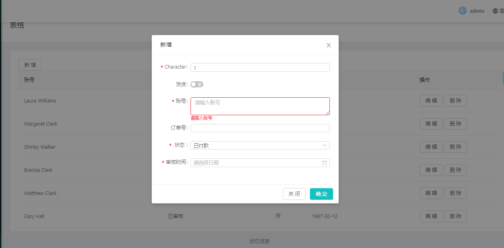
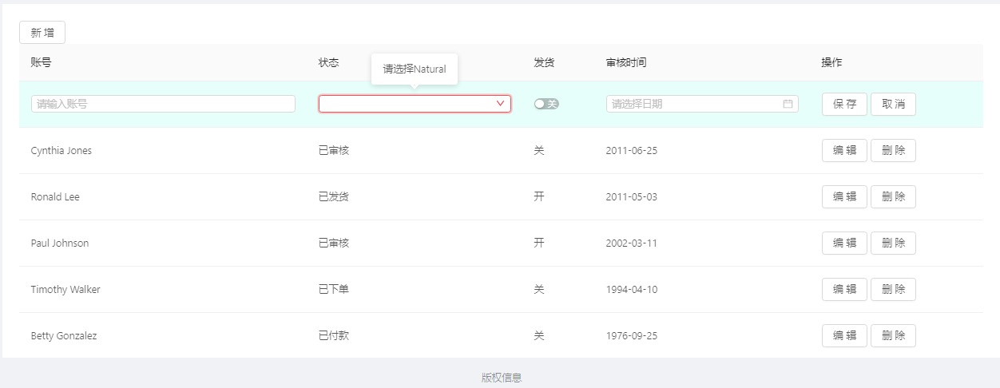
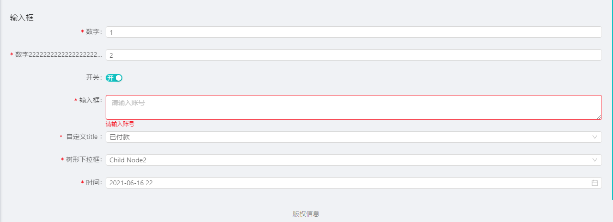
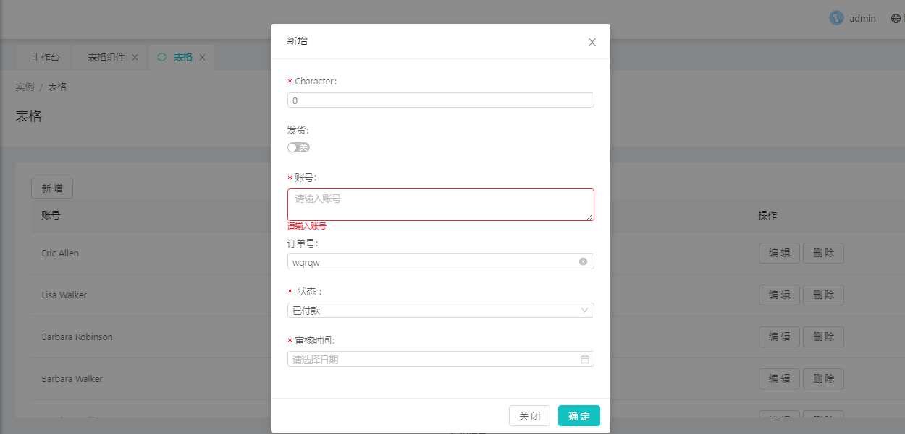

## 1、输入框基础组件

### 使用
```
<editor-item :editor="Object"></editor-item>
```
### props

| 属性名              | required | type          | default        | 说明                                                              |
| -------------------| -------- | ------------- | ---------------|------------------------------------------------------------------ |
| editor        	 | true     | Object        | {}          	 | 表单核心对象                        								  |

### props.editor

| 属性名              | type          | default        | 说明                                                              							  |
| -------------------| ------------- | ---------------|----------------------------------------------------------------------------------------------|
| type               | String        | input          | 目前支持的输入框类型有，input、switch、time、date、datetime、select、treeselect、number、textarea|
| props              | Object        | {}          	  | 同antd输入框类型的props 																	   |
| format             | String        | null           | 专门为时间设置的显示格式，例如：YYYY-MM-DD HH 													|
| rules 		     | Object        | {}             | 验证输入框值，例如：rules:{ required:{ validator:function(){}, message:'validator返回false时显示的信息' }}，如果props里面有required，且无placeholder，当rules没有required对象时，组件默认在rules里面添加required对象，这就是为什么该组件有个name属性的原因               | 
| validate 		     | Object        | {}             | validate:{status:'',message:''} rules验证完毕所返回的状态，例如rules里有个validator返回了个false，那么status为error，message为错误信息 |
| options 		     | Object        | {}             | 组件提供一些下拉选项，里面的属性：valueField，textField，data:[]，formatter（可选，格式化某一项数据）|
| priority 		     | Number        | null             | 当有多个组件组合时，用于排序|


## 2、输入框面板组件

组件以1基础，形成新的组件
### 使用
```
<editor-panel :columns="columns" formLayout="horizontal" :hideLabel="true" :hideErrorMessage="true" />
```
### props

| 属性名              | required | type          | default        | 说明                                                               |
| -------------------| -------- | ------------- | ---------------|------------------------------------------------------------------  |
| labelStyle         | false    | Object        | {}             | 给formItem组件label添加style，比如最大宽度等等       				 |
| formLayout         | false    | String        | vertical     	 | form表单label和输入框的位置关系，vertical 垂直结构,horizontal 水平结构 |
| hideLabel          | false    | Boolean       | false          | 隐藏form表单中的label标签                                            |
| hideErrorMessage   | false    | Boolean       | false          | 隐藏form表单下的提示信息                                             |
| columns        	 | true     | Array         | []          	 | 表单核心对象，数组每一项同1中props.editor                        	 |

### 插槽
只支持自定义label插槽
columns数组项中 item.slots.title，用法同table自定义title一样


### 3、弹出框输入框面板组件

组件以2为基础，形成新的组件
### 使用
```
<optTableModal
	:columns="eColumns"
	:title="eTitle"
	:maskClosable="false"
	:formLayout="formLayout"
	@ok="saveSucEvent"
	@unok="saveErrorEvent"
	@cancel="cancel"
>
	<template :slot="slot" v-for="slot in slots">
		<slot :name="slot"></slot>
	</template>
</optTableModal>
```
### props

| 属性名              | required | type          | default        | 说明                                                              |
| -------------------| -------- | ------------- | ---------------|------------------------------------------------------------------ |
| Modal.props        |          |               |                | antd vue Modal组件所有的属性       								  |
| formLayout         | false    | String        | vertical     	 | 同2中formLayout 													 |
| columns        	 | true     | Array         | []          	 | 同2中columns														 |

### 事件
| 名称					| 说明 														 | 回调参数						 |
| --------------------| ---------------------------------| ---------------------------------------------|
| ok									| 点击确定按钮所有输入框都验证通过		 | function(values){} valus当前所有输入框的值			|
| unok								| 点击确定按钮存在输入框都验证不通过	 | function(values){} valus当前所有输入框的值			|
| cancel							| 关闭模态框												 | function(){}						|

### 插槽
同2


## 4、表格组件

组件以2为基础，形成新的组件
### 使用
```
<advance-table
	ref="adTable"
	rowKey="String"
	formLayout="horizontal"
	:columns="columns"
	:data-source="dataSource"
	:loading="loading"
	:pagination="pagination"
	:eto="eto"
	@change="onChange"
	@etSuccess="etSuccess"
	@etCancel="etCancel"
	@etIng="etIng"
>
	<template slot="statusTitle">
		状态
	</template>
	<template slot="options" slot-scope="value">
		<template v-if="eto.style==='modal' || (eto.style != 'modal' && eto.index != value.index)">
			<a-button @click="editRecord(value)">编辑</a-button>
			<a-button @click="deleteRecord(value)">删除</a-button>
		</template>
		<template v-else>
			<a-button @click="saveRecord()" :loading="saveLoading">保存</a-button>
			<a-button @click="cancel()">取消</a-button>
		</template>
	</template>
</advance-table>
```
### props

| 属性名              | required | type          | default        | 说明                                                              |
| -------------------| -------- | ------------- | ---------------|------------------------------------------------------------------ |
| Table.props        |          |               |                | antd vue Table组件所有的属性       								  |
| formLayout         | false    | String        | vertical     	 | 同2中formLayout 													 |
| eto		         | true     | Object        |           	 | 																	|

### props.eto

| 属性名              | required | type          | default        | 说明                                                              |
| -------------------| -------- | ------------- | ---------------|------------------------------------------------------------------ |
| style        		 | false    | String        | modal          | modal 弹出框操作、inline 表格行中编辑       							|
| title         	 | false    | String        | ''      		 | modal时有效，弹出框的title 										   |
| index		         | true     | Object        | -1          	 | 表格编辑的行索引														|

### 方法
edit
add
save
cancel
### 事件
| 名称									| 说明 														 | 回调参数							|
| -------------------------------------| -----------------------------------------------------------| ---------------------------------|
| change								| 分页控件变化时		 									 |  								|
| etSuccess								| 验证成功最后回调	 										 | function(values,cb){}			|
| etError								| 保存失败最后回调											 | function(values){}				|
| etCancel								| 取消编辑												 	| function(){}						|
| etIng									| 编辑中												 	| function(loading){}				|
### 插槽
同Antd vue Table

用法见./demo/demo.vue

效果如下图




